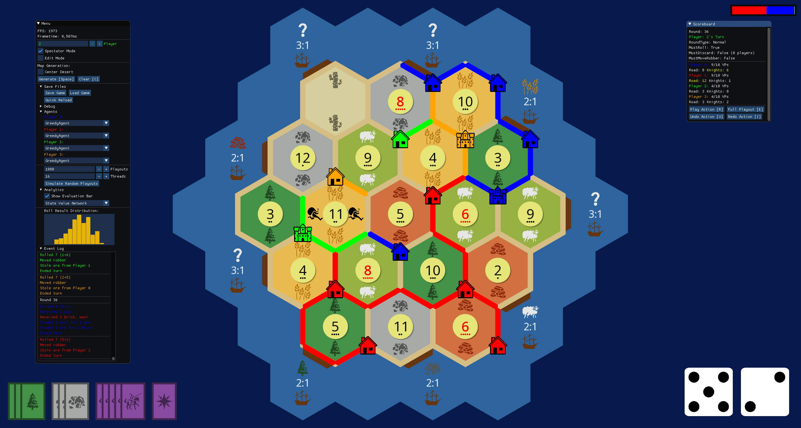

# CatanSim
Settlers of Catan simulator and AI agent sandbox featuring ML-based and handcrafted agents, a parallelized dataset generator, and save file serialization.

## Structure
The codebase is divided into several projects:
- **Agents:** Implementation of various game playing agents/bots and their underlying models.
- **Client:** Simulator GUI frontend enabling manual and automatic playouts, detailed game analysis, configuration and saving/loading.
- **Common:** Simulator library containing game data structures, transactional action system, move legality validation, YAML serialization, and map generation.
- **DatasetCollector:** High-performance CLI simulation interface for the generation of large-scale Catan datasets.
- **DatasetProcessing:** Formatting tool for the conversion of simulator save files into feature vectors and grouped train/val/test splitting.
- **Server:** Simulator server for online multiplayer (future work).

## Credits
Programming by Lasse Huber-Saffer.

The client depends on [SFML.Net](https://www.sfml-dev.org/), [ImGui.Net](https://github.com/ImGuiNET/ImGui.NET), and [ImGuiSFML](https://www.nuget.org/packages/Saffron.Util.ImGuiSFML/1.3.0/).

Icons are provided by [Game-Icons.net](https://game-icons.net/) as [CC-BY](https://creativecommons.org/licenses/by/4.0/deed): 
- "backup", "cash", "folded-paper", "galleon", "hourglass", "pine-tree", "stone-crafting", "uncertainty", "wheat" by Lorc
- "bank", "brick-pile", "cactus", "castle", "check-mark", "confirmed", "dice-six-faces-one", "dice-six-faces-two", "dice-six-faces-three", "dice-six-faces-four", "dice-six-faces-five", "dice-six-faces-six", "house", "next-button", "polar-star", "robber", "rolled-cloth", "scroll-quill", "sheep", "sickle", "stone-path", "stone-pile", "thumb-down", "thumb-up", "village", "wood-pile" by Delapouite
- "cancel" by sbed
- "mounted-knight" by Skoll
